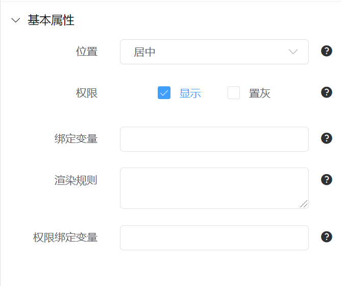

# 基础知识

## 基本属性



### 位置

设置组件布局位置。

- 居中
- 居左
- 居右

### 权限

- 显示
  默认勾选显示，取消勾选后预览和实际使用时不会显示此组件。
- 置灰
  默认不勾选，勾选置灰时选中组件只读。

### 绑定变量

- 组件的绑定变量，用于存储组件内的数据。
- 若组件内包含动态数据，此字段必填。
- 其中变量名可以自定义命名。

### 权限绑定变量

绑定权限变量，用于后端控制组件显示与否。

## 名词解释

### 交易

`api` 和 `tran_type` 两个参数确定一个交易（后台接口）。
例子：api 为`/interface/sys/menu`,tran_type 为`get_menu_list`。
其中`interface`为固定头部，后边的`sys/menu`对应后台 app 目录下的`sys`目录下的`menu.py`，`get_menu_list`对应`menu.py`内的`get_menu_list`函数。

```
├── admin_app
│   └── sys
│       └── menu.py
```

### 渲染规则

按一定的规则渲染组件内的数据，预览表单时会自动将渲染规则执行结果覆盖对应的绑定变量。比如可以配置`GetValueFromSQL{select xxx,xxx form xxx}`来查询数据库内数据。
