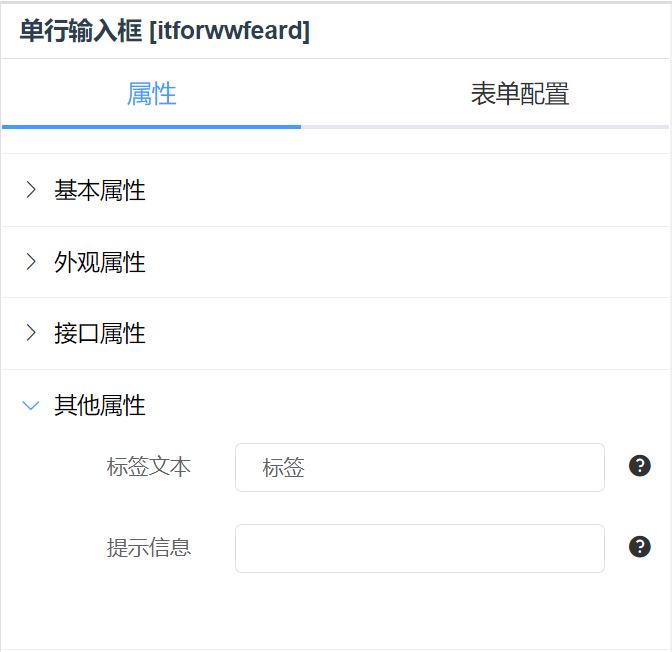
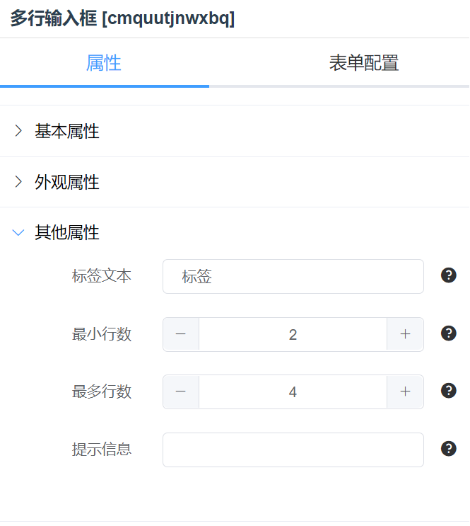
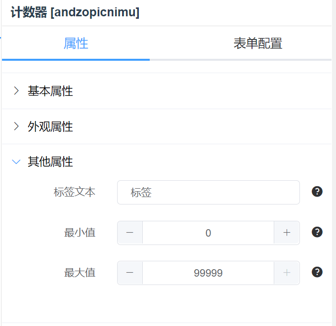

# 输入控件

## 单行输入框


### 尺寸

对应 element 组件的 size。

- 默认
- 小型
- 超小

### 标签列数

控制输入框前边标签的栅格列数（24 栅格）。

### 内容列数

控制标签后输入框的栅格列数（24 栅格）。


### 回车 api

配合回车 tran_type 使用。

### 回车 tran_type

在输入框内回车后执行的交易。[交易说明](../base.md#交易)



### 标签文本

输入框前边的标签文本内容。

### 提示信息

输入框的输入提示信息。

## 多行输入框



相比单行输入框多了`最小行数`和`最多行数`属性，控制多行输入框的最小和最大行数。

## 计数器



相比单行输入框多了`最小值`和`最大值`属性，控制计数器最小和最大值。

## md5 密码框

暂无介绍

## json 编辑器

### 高度

控制编辑器的高度。

## 可编辑表格


### 按钮开关

- 用于控制`添加`和`删除`按钮是否显示。
- `添加`和`删除`按钮可添加和删除表格行。

### 表头配置

- 字段名
  与数据结构字段对应。
- 标题
  显示的表头名。
- 对齐
  对齐方式。
- 宽度
  列宽度。
- 类型
  单元格渲染组件类型，暂时支持文本、日期、日期时间。
- 绑定变量
- 操作
  可增加或删除表头

测试数据结构

```json
[
  {
    "date": "2021-05-27",
    "name": "张三",
    "address": "许昌市"
  },
  {
    "date": "2021-05-28",
    "name": "李四",
    "address": "北京市"
  },
  {
    "date": "2021-05-29",
    "name": "王五",
    "address": "上海市"
  }
]
```

### 原生样式

勾选后渲染成原生表格样式（默认是 element 表格样式）。

## 滑块

相比单行输入框多了`最小值`和`最大值`属性，控制滑块最小和最大值。
