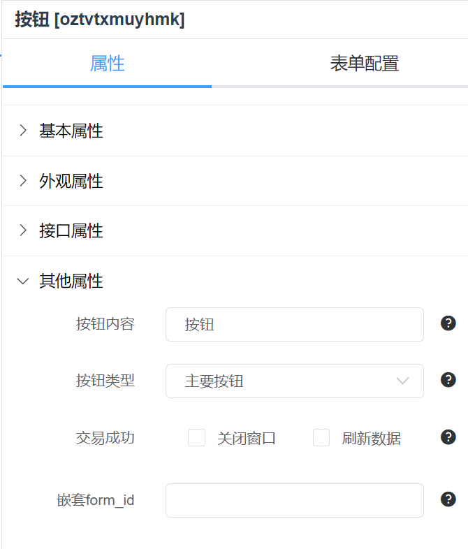
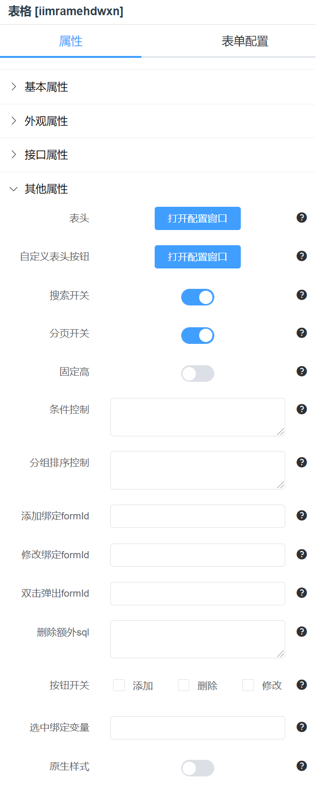
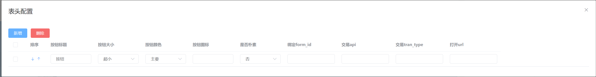
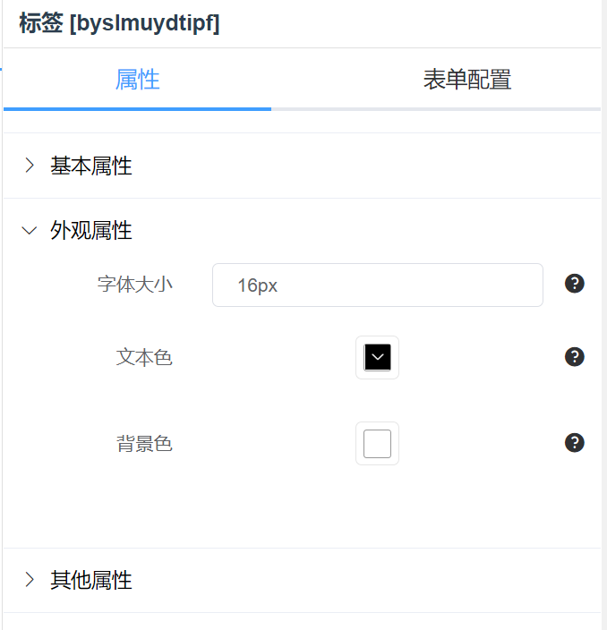

# 其他控件

## 按钮


### 交易

- 点击按钮时执行的交易。
- 交易 api 和交易类型对应 api 和 tran_type。
- 交易附加 SQL:当 api 和 tran_type 为默认时为执行 sql，可配置要执行的 sql 内容。示例如下：

```sql
# 示例1
insert into test_table(b,c,update_time) value($[b],$[c],now());
# 示例2
update test_table set b=$[b],c=$[c],update_time=now() where tid=$[tid];
```

其中 sql 在执行时会将`$[x]`替换成表单内的`x`变量。



### 按钮内容

配置按钮显示名称。

### 按钮类型

配置按钮颜色

### 交易成功

- 勾选关闭窗口，交易成功后会将当前 form 窗口关闭。

### 刷新数据

- 勾选刷新数据，交易成功后会调用上层 form 的初始化函数。
- 例如在 form1 配置表格，form2 配置添加表单，form2 的确认按钮配置交易并勾选`关闭窗口`和`刷新数据`。则 form2 内的确认按钮点击后执行添加操作，并关闭添加窗口，同时刷新 form1 内表格的数据。

## 表格


### 数据接口

- 表格的数据源接口。
- 数据 api 和数据 tran_type 确定一个数据接口。
- 数据 sql:当 api 和 tran_type 为默认时为执行 sql，可配置要执行的 sql 内容。示例如下：

```sql
select id,text,user_id from test_order
```



### 表头配置


- 选择要配置的表后点击生成快速添加表字段。
- 添加和删除按钮可对字段进行二次编辑。
- 可对表头字段进行排序，和一些参数配置。
- 辅助 sql 可用于辅助 sql 编写。

### 自定义表头按钮



- 可对表格顶部的按钮进行自定义配置。
- 配置绑定 formid 可用来打开新的配置表单。
- 交易配置用来配置点击按钮后给后台发送的交易。
- 打开 url 可配置点击按钮后打开新页面的地址。格式为：

```
# 普通链接
https://www.baidu.com
# 动态链接:例如会被渲染成https://pmadmin.pinmait.com/home?uid=1&checksum=111111
$[root]/home?uid=$[SYS_UID]&checksum=$[SYS_CHECKSUM]
```

### 搜索开关

开启后，启用可查询的表头字段可在表格顶部以关键字进行查询。

### 分页开关

开始后，表格底部显示分页器。

### 条件控制

数据 sql 需要 where 条件时在此处配置，例如：

```sql
where uid=$[uid]
```

### 分组排序控制

数据 sql 需要分组排序时在此处配置，例如：

```sql
order by create_time desc
```

### 添加绑定 formid

点击表格顶部的添加按钮弹出的 form。

### 修改绑定 formid

- 不推荐使用
- 用行内编辑按钮替代

### 双击弹出 formid

- 不推荐使用
- 用行内编辑按钮替代

### 删除额外 sql

点击表格顶部的删除按钮时执行的 sql。例如：

```sql
delete from test_table where id=$[selected]
```

### 按钮开关

控制表格顶部的添加、修改、删除按钮的启用。

### 选中绑定变量

选中表格行的时候选中数据绑定的变量。

### 原生样式

开启后表格样式为元素 table 样式(默认为 element 表格样式)。

## 标签



### 字体大小

控制标签字体大小

### 文本色

标签文本颜色

### 背景色

标签背景颜色

## 打印

暂无介绍

## 图片展示

暂无介绍

## 树

暂无介绍

## 定时器

暂无介绍
