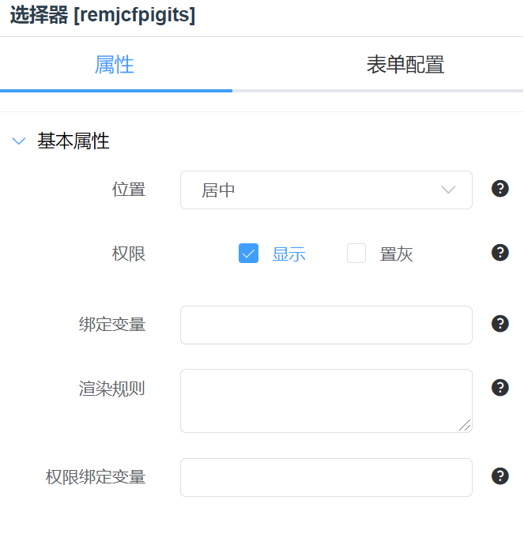
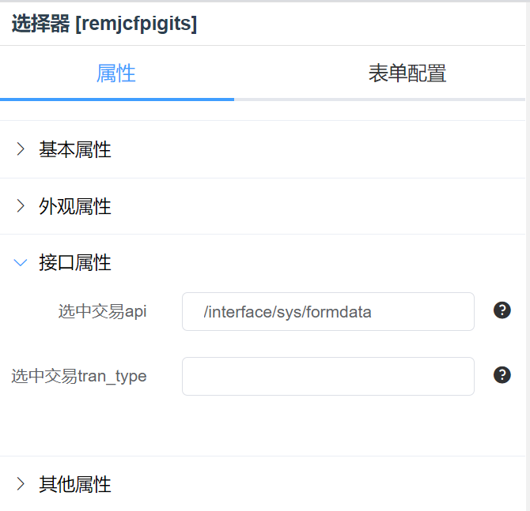

# 选择控件

## 选择器



### 绑定变量

选择器接收值绑定的变量名。

### 渲染规则

可配置渲染规则来渲染绑定变量。



### 选中交易

选择器选中某一项值时执行的交易。[交易说明](../base.md#交易)


### 选项渲染规则

可配置 sql 来实现动态选项列表。例如：

```sql
GetValueFromSQL{select dict_key,dict_value from table_dict where dict_name='test'}
```

### 选项变量

选择器的选项绑定的变量，选项数据格式示例为：

```json
[
  {
    "key": "op1",
    "value": "选项1"
  },
  {
    "key": "op2",
    "value": "选项2"
  },
  {
    "key": "op3",
    "value": "选项3"
  }
]
```

### 是否显示 key

勾选后选项列表会自动加上 key 前缀，如`op1-选项1`

## 日期选择器

暂无介绍

## 日期时间选择器

暂无介绍

## 单选框

- 与选择器类型

## 多选框

- 与选择器类型
- 注意绑定变量是 Array 类型

## 穿梭框

暂无介绍

## 开关

- 注意绑定变量是 Boolean 类型
