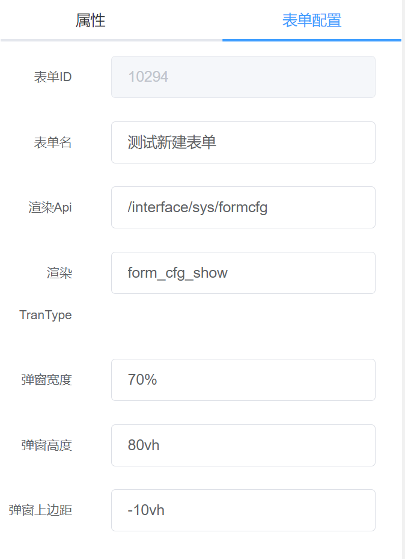

# 界面介绍

### 顶部导航条

- 保存按钮

  用于保存当前的表单配置，配置完表单后要及时保存，否则刷新页面会丢失配置信息。

- 删除按钮

  选中设计面板的组件后，点击删除按钮可以删除组件，删除后也需保存才会永久生效。

- 预览按钮

  保存配置后点击预览可以预览表单。

- 变量配置

  可以配置表单中用到的一些变量，供表单渲染时解析使用。详细配置见 [变量配置](variable.md)

- 配置数据预览

  可以看到当前表单的完整配置信息(JSON)。

- 快速创建

  可以快速创建表格。详细介绍见 [快速创建](fast-create.md)

### 左侧组件面板

组件面板包含了表单配置中所有可用到的组件，可点击组件拖动到中间的设计面板实现界面布局。详细介绍见 [组件介绍](comp-desc.md)

### 设计面板

用于预览布局效果，可在此面板拖动组件实现布局调整。

### 属性面板

属性面板包括组件属性和表单属性。

- 组件属性

  在设计面板点击组件后，可以在右侧属性面板看到组件相关的属性。可通过配置不同属性实现业务功能。

- 表单属性

  

  其中渲染 Api 和渲染 TranType 为初始化表单时的解析接口，不需要自定义时默认即可。弹窗宽度、弹窗高度、弹窗上边距用于控制弹窗布局（当表单以弹窗形式展示时生效）。
