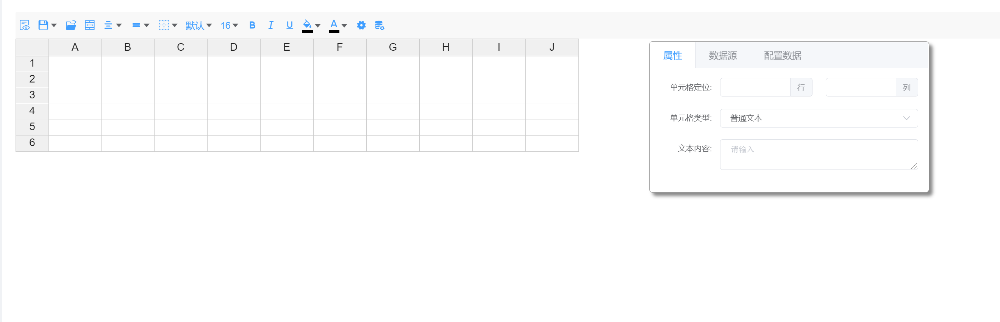
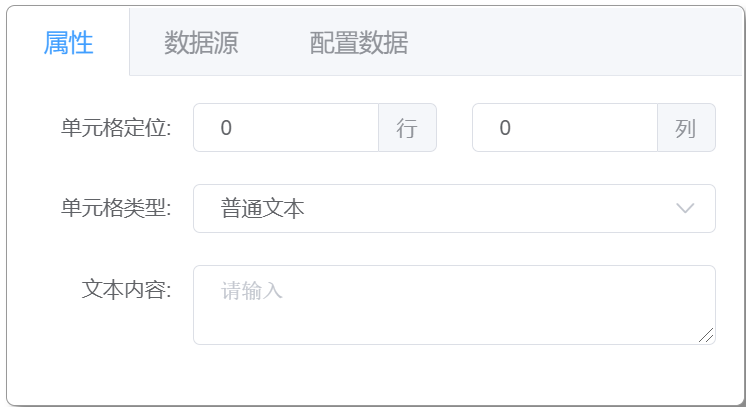

# 界面介绍

### 顶部导航条

- 预览按钮

  用于预览当前配置报表（配置报表需已保存）。

- 保存/另存为按钮

  按钮默认为保存按钮，点击按钮后可对当前报表配置进行保存；同时可在下拉菜单中选择另存为，将当前报表配置另存为新的报表，不影响原有报表。

- 打开按钮

  点击打开按钮，弹出弹窗，可选择已保存的历史配置报表并打开。

- 合并/拆分单元格

  用于对报表单元格进行合并与拆分。

- 横向对齐

  用于对报表单元格横向对齐方式进行设置。

- 纵向对齐

  用于对报表单元格纵向对齐方式进行设置。

- 框线设置

  用于对报表单元格的边框线进行设置。

- 字体设置

  用于对报表单元格的字体进行设置。

- 字号设置

  用于对报表单元格的字号进行设置。

- 加粗设置

  用于对报表单元格的内容进行样式加粗设置。

- 倾斜设置

  用于对报表单元格的内容进行样式倾斜设置。

- 下划线设置

  用于对报表单元格的内容进行样式下滑线设置。

- 背景颜色设置

  用于对报表单元格的背景颜色进行设置。

- 字体颜色设置

  用于对报表单元格的字体颜色进行设置。

- 报表属性设置

  用于对报表的基础配置属性进行设置。

- 默认数据设置

  用于对报表的默认展示数据进行设置(JSON)。

### 单元格属性设置面板

单元格属性设置面板可对选中单元格的基础属性、数据源进行设置，并可查看单元格的完整配置信息(JSON)。

