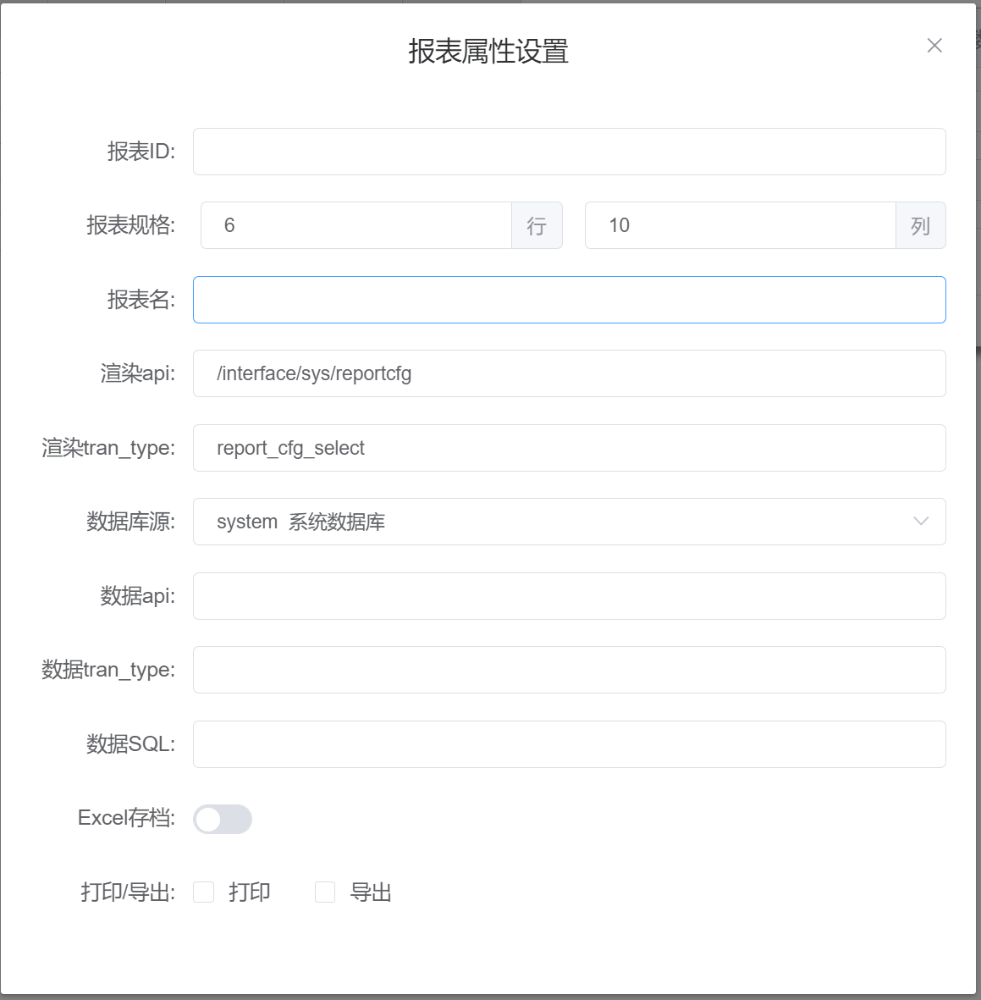

# 报表属性设置

## 基本属性

### 报表 ID

报表保存后自动生成 ID，不可修改。

### 报表规格

显示当前报表行、列数目。

### 报表名

当前报表自定义名称。

### 渲染 api

配合渲染 tran_type 使用，默认 api 为：`/interface/sys/reportcfg`

### 渲染 tran_type

报表渲染时执行的交易。[交易说明](../form/base.md#交易) 
默认 tran_type 为：`report_cfg_select`

### 数据库源

报表数据来源设置，默认使用系统数据库，可选择其他数据库源，数据库源添加可参考数据源管理。[数据源管理](../system/data-source.md)

### 数据 api

配合数据 tran_type 使用，默认 api 为：`/interface/sys/reportcfg`

### 数据 tran_type

报表数据获取时执行的交易。[交易说明](../form/base.md#交易) 
默认 tran_type 为：`report_data_show`

### 数据 SQL

与数据 api 和 数据 tran_type 配合使用。 

注意： 
此处的 SQL 语句应与数据库源对应； 
支持多条 SQL 语句，不同 SQL 语句间用 ; 分号(英文)分隔； 
支持变量替换和关键字替换，页面中数据变量（包括默认数据变量）可作为自动替换 SQL 语句中对应的标志变量 
标志变量写法 `$[数据变量名]`，SQL 示例：`select id,name,age from user where username=$[name]` 
关键字：`${USER_ID} (用户 ID)`、`${USER_NAME} (用户名)`、`${TRAN_DATE} (当前日期)`、`${TRAN_TIME} (当前时间)`、`${TRAN_DATETIME} (当前日期时间)`、`${YYYY} (当前年份)`、`${WEEK} (当年第几周)`

### Excel 存档

导出 excel 时是否系统留存入档开关。

### 打印/导出

报表 打印和导出 excel 按钮显示控制开关。
