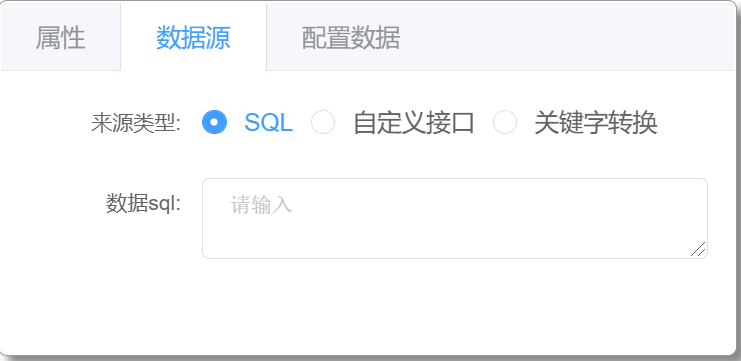
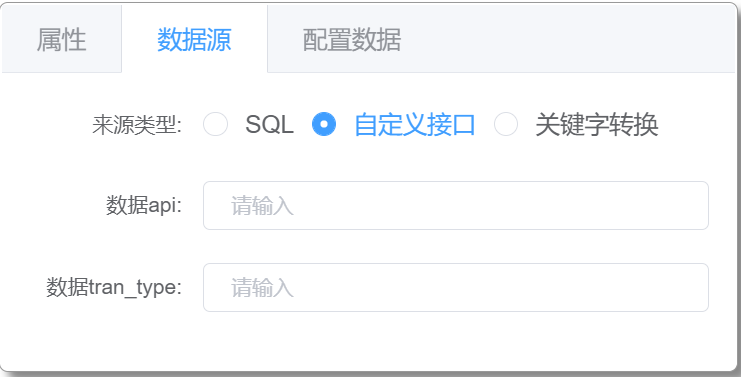
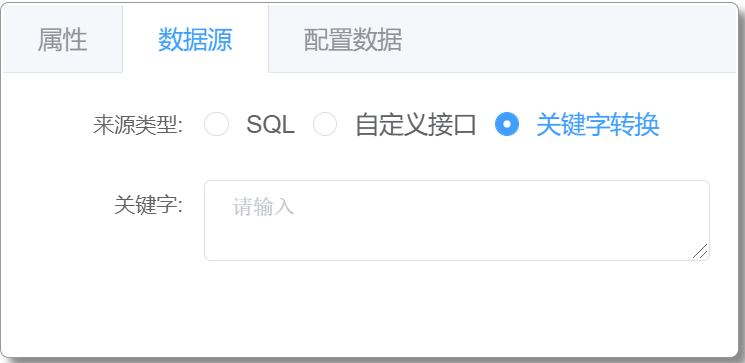

# 单元格数据源设置

## 单元格数据源类型

单元格数据源支持的来源类型有：`SQL`、`自定义接口`、`关键字`

### SQL

此处的 SQL 语句应与数据库源对应； 
支持变量替换和关键字替换，页面中数据变量（包括默认数据变量）可作为自动替换 SQL 语句中对应的标志变量 
标志变量写法 `$[数据变量名]`，SQL 示例：`select id,name,age from user where username=$[name]` 
关键字：`${USER_ID} (用户 ID)`、`${USER_NAME} (用户名)`、`${TRAN_DATE} (当前日期)`、`${TRAN_TIME} (当前时间)`、`${TRAN_DATETIME} (当前日期时间)`、`${YYYY} (当前年份)`、`${WEEK} (当年第几周)`

### 自定义接口

数据 api: 配合数据 tran_type 使用 
数据 tran_type: 单元格绑定变量获取真实数据时执行的交易

### 关键字

绑定变量直接使用关键字替换。 
关键字：`${USER_ID} (用户 ID)`、`${USER_NAME} (用户名)`、`${TRAN_DATE} (当前日期)`、`${TRAN_TIME} (当前时间)`、`${TRAN_DATETIME} (当前日期时间)`、`${YYYY} (当前年份)`、`${WEEK} (当年第几周)`
