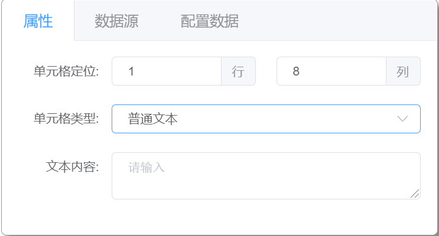
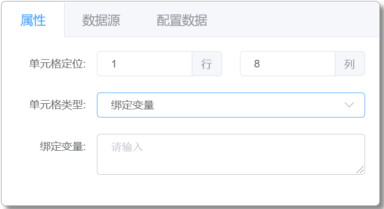
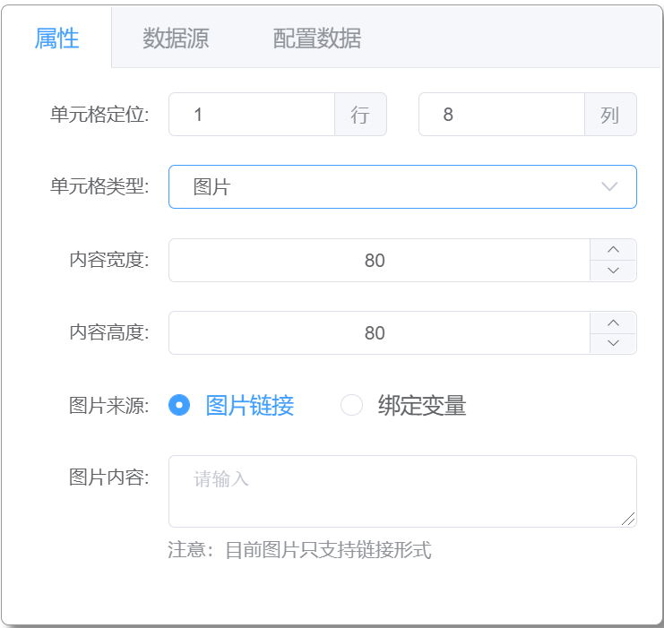

# 单元格属性设置

## 单元格属性类型

单元格属性设置，根据单元格不同属性类型的选择进行相对应的属性设置，属性类型包括：`普通文本`、`绑定变量`、`数据集`、`图片`

### 普通文本

选中单元格设置静态文本。

### 绑定变量

选中单元格设置绑定数据变量，与报表渲染数据 sourceData 中数据变量双向绑定。

### 数据集

选中单元格设置绑定数据集变量，与报表渲染数据 sourceData 中数据变量双向绑定。 
可设置数据展开方式：`向右`、`向下`、`右下`、`不展开` 
向右、向下展开数据结构为一维数组，右下展开为二维数据

### 图片

选中单元格设置显示图片，同时可对图片的宽、高进行设置。 
图片来源支持图片链接和绑定变量(链接形式)。
